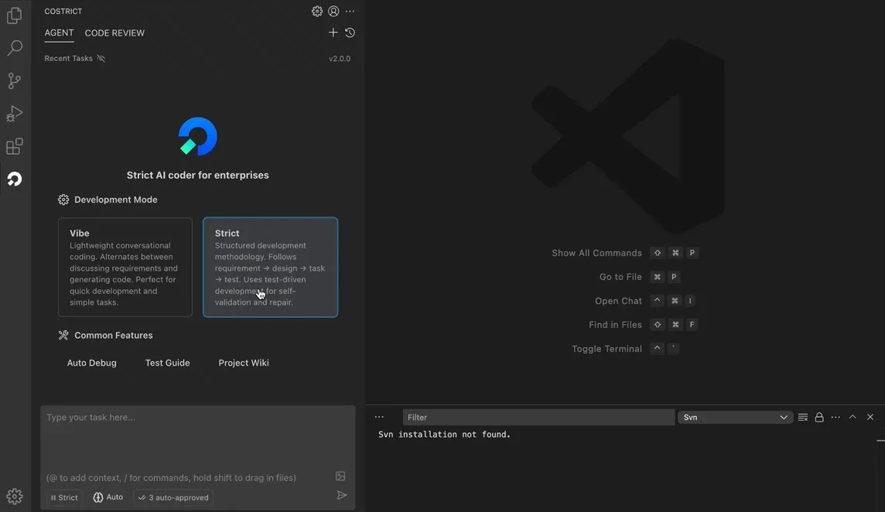
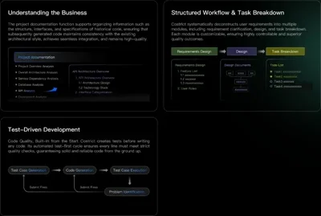
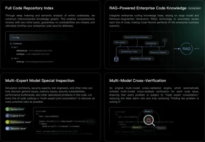
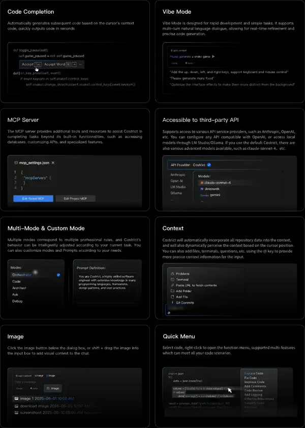

# CoStrict

**Strict AI Coder for Enterprises**

_Free • Open Source • Private Deployment_

[简体中文](./README.zh-CN.md) | English

---

**CoStrict** is a free, open-source AI-powered coding assistant designed for enterprise-grade development. With support for private deployment, it's the optimal choice for organizations requiring secure, standardized AI development workflows.

## ✨ Core Capabilities

| Feature                | Description                                                                                                         |
| ---------------------- | ------------------------------------------------------------------------------------------------------------------- |
| 🔒 **Strict Mode**     | Standardized AI code generation with requirements analysis, architecture design, task planning, and test generation |
| 🔍 **Code Review**     | Repository-wide RAG-based code analysis with multi-expert model verification                                        |
| ⚡ **Code Completion** | Context-aware code generation in seconds                                                                            |
| 🎯 **Vibe Code**       | Rapid development through natural language dialogue                                                                 |
| 🔗 **MCP Integration** | Standardized system connectivity for APIs, databases, and custom tools                                              |
| 🎨 **Multi-modal**     | Support for image context and visual inputs                                                                         |

## 📦 Installation

### VS Code Extension

### CLI Tool

Available for command-line usage:

### JetBrains Plugin

## 🚀 Key Features

### Strict Mode

Standardizes AI-generated code workflows for enterprise scenarios, ensuring high-quality and controllable outputs.

### Code Review

Repository-wide indexing and RAG-based analysis with multi-model verification strategies.

### More Features

- 🌐 **Multi-language Support** - Python, Go, Java, JavaScript/TypeScript, C/C++, and all programming languages
- 🔐 **Privacy & Security** - Professional private deployment with physical isolation and end-to-end encryption
- 🎛️ **API & Model Customization** - Built-in free models + support for Anthropic, OpenAI, OpenAI-compatible APIs, and local models
- 📁 **Large Repository Context** - Automatic context inclusion with @ file/folder mentions
- 🔧 **Mode Customization** - Multiple default modes (Code, Orchestrator) with custom mode support
- 📝 **OpenSpec Integration** - Standardized change proposal workflows with `/openspec-init`

## 📚 Documentation

| Resource           | Link                                                                                               |
| ------------------ | -------------------------------------------------------------------------------------------------- |
| Installation Guide | [docs.costrict.ai/en/guide/installation](https://docs.costrict.ai/en/guide/installation)           |
| Private Deployment | [docs.costrict.ai/en/deployment/introduction](https://docs.costrict.ai/en/deployment/introduction) |
| Tutorial Videos    | [docs.costrict.ai/en/tutorial-videos/video](https://docs.costrict.ai/en/tutorial-videos/video)     |
| CLI Documentation  | [docs.costrict.ai/cli/guide/installation](https://docs.costrict.ai/cli/guide/installation)         |

## 🤝 Community & Support

<table>
  <tr>
    <td align="center" width="33%">
       
      <b>WeChat Group</b>
    </td>
    <td align="center" width="33%">
       
      <b>Feedback</b>
    </td>
    <td align="center" width="33%">
      
    </td>
  </tr>
</table>

## 🤝 Contributing

We welcome contributions! Please see our [Contributing Guide](assets/docs/devel/en-US/how-to-contribute.md) for details.

## 📄 License

[Apache 2.0 © 2025 Sangfor, Inc.](./LICENSE)

## ⭐ Star History

## 🙏 Acknowledgments

Special thanks to our open-source partners:

---

## Disclaimer

**Please note** that Sangfor, Inc does **not** make any representations or warranties regarding any code, models, or other tools provided or made available in connection with CoStrict, any associated third-party tools, or any resulting outputs. You assume **all risks** associated with the use of any such tools or outputs; such tools are provided on an **"AS IS"** and **"AS AVAILABLE"** basis. Such risks may include, without limitation, intellectual property infringement, cyber vulnerabilities or attacks, bias, inaccuracies, errors, defects, viruses, downtime, property loss or damage, and/or personal injury. You are solely responsible for your use of any such tools or outputs (including, without limitation, the legality, appropriateness, and results thereof).
