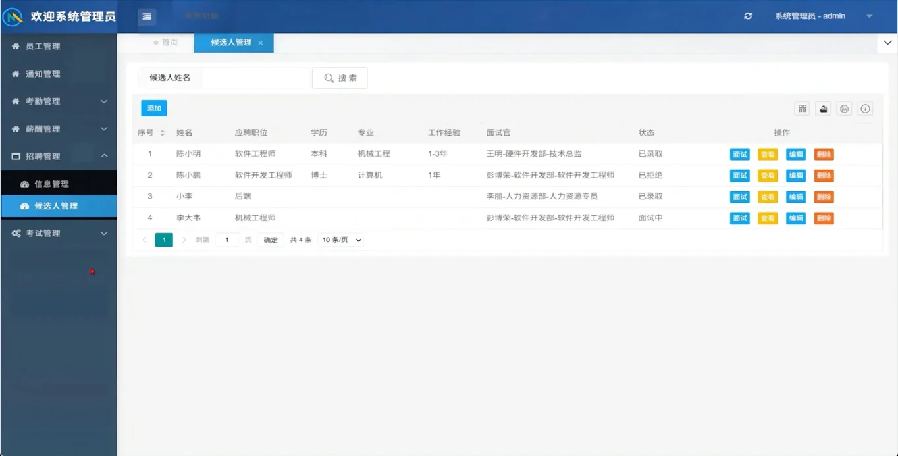
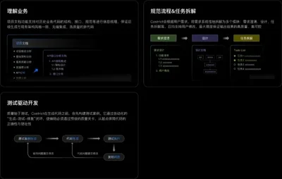
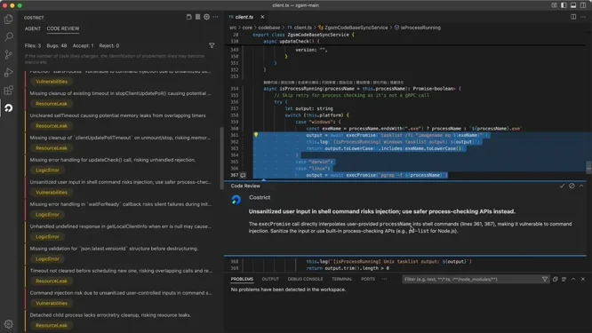
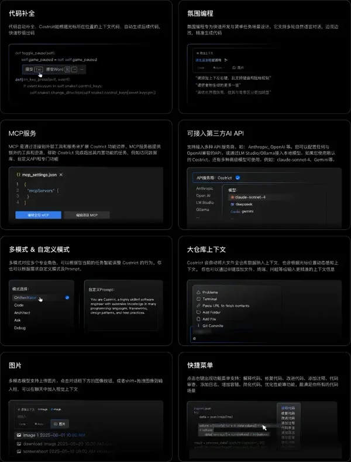

# CoStrict

**企业严肃开发的 AI 智能体伙伴**

_免费 • 开源 • 支持私有化部署_

English | [简体中文](./README.zh-CN.md)

---

**CoStrict** 是一款免费开源的 AI 辅助编程工具，专为企业级开发场景设计。支持私有化部署，是组织级安全、标准化 AI 开发工作流的最佳选择。

## ✨ 核心能力

| 功能            | 描述                                                               |
| --------------- | ------------------------------------------------------------------ |
| 🔒 **严肃编程** | 标准化 AI 代码生成流程，包含需求分析、架构设计、任务规划、测试生成 |
| 🔍 **代码审查** | 基于全仓库 RAG 的代码分析，采用多专家模型交叉验证                  |
| ⚡ **代码补全** | 秒级上下文感知代码生成                                             |
| 🎯 **氛围编程** | 自然语言多轮对话快速开发                                           |
| 🔗 **MCP 集成** | 标准化系统连接，支持 API、数据库、自定义工具集成                   |
| 🎨 **多模态**   | 支持图片上传和视觉上下文输入                                       |

## 📦 安装方式

### VS Code 扩展

### 命令行工具

支持命令行使用：

### JetBrains 插件

## 🚀 主要特性

### 严肃编程（Strict Mode）

规范 AI 生成代码流程，使其符合企业开发场景，确保输出高质量、高可控。

### 代码审查（Code Review）

全仓库索引解析，公司级编码知识库 RAG，采用多专家模型专项检查 + 多模型交叉确认策略。

### 更多特性

- 🌐 **多语言支持** - Python、Go、Java、JavaScript/TypeScript、C/C++ 及所有编程语言
- 🔐 **隐私与安全** - 专业私有化部署方案，物理隔离 + 端到端加密
- 🎛️ **API 与模型自定义** - 内置免费高级模型 + 支持 Anthropic、OpenAI、兼容 OpenAI 的 API 及本地模型
- 📁 **大仓库上下文** - 自动纳入全仓库上下文，支持 @ 文件/文件夹提及
- 🔧 **模式自定义** - 多种默认模式（Code、Orchestrator）+ 自定义模式支持
- 📝 **OpenSpec 集成** - 通过 `/openspec-init` 初始化标准化变更提案工作流
- 🖱️ **快捷菜单** - 选中代码右键菜单，支持解释、修复、改进、注释、审查、日志、容错、简化、性能优化等功能

## 📚 文档资源

| 资源       | 链接                                                                                         |
| ---------- | -------------------------------------------------------------------------------------------- |
| 安装指南   | [docs.costrict.ai/guide/installation](https://docs.costrict.ai/guide/installation)           |
| 私有化部署 | [docs.costrict.ai/deployment/introduction](https://docs.costrict.ai/deployment/introduction) |
| 教程视频   | [docs.costrict.ai/tutorial-videos/video](https://docs.costrict.ai/tutorial-videos/video)     |
| CLI 文档   | [docs.costrict.ai/cli/guide/installation](https://docs.costrict.ai/cli/guide/installation)   |

## 🤝 社区与支持

<table>
  <tr>
    <td align="center" width="33%">
       
      <b>微信群</b>
    </td>
    <td align="center" width="33%">
       
      <b>意见反馈</b>
    </td>
    <td align="center" width="33%">
      
    </td>
  </tr>
</table>

## 🤝 参与贡献

欢迎参与贡献！详情请查看 [贡献指南](assets/docs/devel/zh-CN/fork.md)。

### 上报问题

在 [Issues](https://github.com/zgsm-ai/costrict/issues) 搜索确认问题未被报告后，可 [新建 Issue](https://github.com/zgsm-ai/costrict/issues/new/choose)。

### 提交代码

采用 GitHub Forking 工作流，详见 [代码贡献流程](https://github.com/zgsm-ai/costrict/blob/main/assets/docs/devel/zh-CN/fork.md)。

## 📄 许可证

[Apache 2.0 © 2025 Sangfor, Inc.](./LICENSE)

## ⭐ Star 历史

## 🙏 致谢

特别感谢以下开源项目：

---

## 免责声明

**请注意**，Sangfor, Inc. **不**对与 CoStrict 相关的任何代码、模型或其他工具、任何相关的第三方工具或任何由此产生的输出作出任何陈述或保证。您承担使用任何此类工具或输出的**所有风险**；此类工具均按**"原样"**和**"可用"**的基础提供。此类风险可能包括但不限于知识产权侵权、网络漏洞或攻击、偏见、不准确、错误、缺陷、病毒、停机、财产损失或损害和/或人身伤害。您对自己使用任何此类工具或输出负全部责任（包括但不限于其合法性、适当性和结果）。
